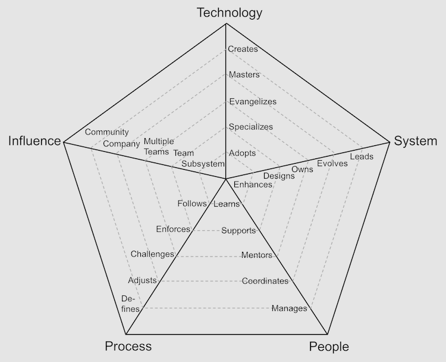

# Introduction

This framework allows software engineering managers to have meaningful conversations with their direct reports around the expectations of each position and how to plan for the next level in their career ladder.

Although the framework uses roles and levels that are somewhat standard in the US tech industry, every company is different. Please use the information provided as a baseline and feel free adjust it to your needs.

The framework relies heavily in radar charts to show visually the different perspectives and expectations of a given position:

# Career Ladders

The framework has 4 different ladders:

* [**Developer**](Developer.md): role also known as programmer or software engineer, requires a deep level of technical expertise
* [**Tech Lead**](TechLead.md): role also known as dev lead, is the owner of the system and requires a unique balance between hands-on development, architecture knowledge and production support
* [**Technical Program Manager**](TechnicalProgramManager.md): role responsible for coordinating and driving to completion initiatives that expand multiple teams
* [**Engineering Manager**](EngineeringManager.md): role also known as dev manager, is responsible for the consistent delivery, career growth and level of happiness of the team

If you are confused about the difference between a [Tech Lead](TechLead.md) and an [Engineering Manager](EngineeringManager.md), please refer to the [Tech Lead vs Engineering Manager](TechLead-EngineeringManager.md) page for a detailed comparison.

| Level | Seniority | [Developer](Developer.md) | [Tech Lead](TechLead.md) | [Technical Program Manager](TechnicalProgramManager.md) | [Engineering Manager](EngineeringManager.md) |
| :---: | :---: | :---: | :---: | :---: |  :---: |
| 1 | Junior | [D1](Developer.md#d1---developer-1) | | | |
| 2 | Junior | [D2](Developer.md#d2---developer-2) | | | |
| 3 | Junior | [D3](Developer.md#d3---developer-3) | | | |
| 4 | Senior | [D4](Developer.md#d4---developer-4) | [TL4](TechLead.md#tl4---tech-lead-4) | [TPM4](TechnicalProgramManager.md#tpm4---technical-program-manager-4) | |
| 5 | Senior | [D5](Developer.md#d5---developer-5) | [TL5](TechLead.md#tl5---tech-lead-5) | [TPM5](TechnicalProgramManager.md#tpm5---technical-program-manager-5) | [EM5](EngineeringManager.md#em5---engineering-manager-5) |
| 6 | Senior | [D6](Developer.md#d6---developer-6) | [TL6](TechLead.md#tl6---tech-lead-6) | [TPM6](TechnicalProgramManager.md#tpm6---technical-program-manager-6) | [EM6](EngineeringManager.md#em6---engineering-manager-6) |
| 7 | Senior | [D7](Developer.md#d7---developer-7) | [TL7](TechLead.md#tl7---tech-lead-7) | [TPM7](TechnicalProgramManager.md#tpm7---technical-program-manager-7) | [EM7](EngineeringManager.md#em7---engineering-manager-7) |

(click on position name for more details)

# Axes

The chart shown above has the following 5 axes:
* **Technology**: knowledge of the tech stack and tools
* **System**: level of ownership of the system(s)
* **People**: relationship with the team(s)
* **Process**: level of engagement with the development process
* **Influence**: scope of influence of the position

The **influence** axis can be seen as a *different dimension* since it is orthogonal and applies to all the other axes.

Each axis has 5 different levels of performance. It is important to highlight that every level includes the previous one(s). For example, someone that *evangelizes* technology, *specializes* and *adopts* it as well.

Keep reading to better understand each level.

# Levels

## Technology

1. **Adopts**: actively learns and adopts the technology and tools defined by the team
2. **Specializes**: is the go-to person for one or more technologies and takes initiative to learn new ones
3. **Evangelizes**: researches, creates proofs of concept and introduces new technologies to the team
4. **Masters**: has very deep knowledge about the whole technology stack of the system
5. **Creates**: designs and creates new technologies that are widely used either by internal or external teams

## System

1. **Enhances**: successfully pushes new features and bug fixes to improve and extend the system
2. **Designs**: designs and implements medium to large size features while reducing the system's tech debt
3. **Owns**: owns the production operation and monitoring of the system and is aware of its SLAs
4. **Evolves**: evolves the architecture to support future requirements and defines its SLAs
5. **Leads**: leads the technical excellence of the system and creates plans to mitigate outages

## People

1. **Learns**: quickly learns from others and consistently steps up when it is required
2. **Supports**: proactively supports other team members and helps them to be successful
3. **Mentors**: mentors others to accelerate their career-growth and encourages them to participate
4. **Coordinates**: coordinates team members providing effective feedback and moderating discussions
5. **Manages**: manages the team members' career, expectations, performance and level of happiness

## Process

1. **Follows**: follows the team processes, delivering a consistent flow of features to production
2. **Enforces**: enforces the team processes, making sure everybody understands the benefits and tradeoffs
3. **Challenges**: challenges the team processes, looking for ways to improve them
4. **Adjusts**: adjusts the team processes, listening to feedback and guiding the team through the changes
5. **Defines**: defines the right processes for the team's maturity level, balancing agility and discipline

## Influence

1. **Subsystem**: makes an impact on one or more subsystems
2. **Team**: makes an impact on the whole team, not just on specific parts of it
3. **Multiple Teams**: makes an impact not only his/her team but also on other teams
4. **Company**: makes an impact on the whole tech organization
5. **Community**: makes an impact on the tech community

# FAQs

**What if some of the people don't meet all the points?**

That is very normal, people are usually stronger in some areas and weaker in others. The framework should not be used as a checklist to promote people but instead as guidance to have meaningful career conversations.

**What if my organization's career ladder is different?**

Since the framework is open source, you have the opportunity to adapt it to your organization. Feel free to use the [chart template](charts/template.png) to define your own levels.

**When is a person ready to move to the next level?**

Companies usually expect a person to be performing at the next level *consistently for several months* before formalizing a promotion.

**How do I collect evidence to support the discussion with my direct reports?**

Different teams collect evidence in different ways. A recommended approach is to use a combination of:
* 1:1 conversations
* Feedback from peers and other teams
* Self-evaluation

**Could the framework provide more specific examples of behavior to support each level?**

Specific examples of behavior require knowledge about the way that the team works, the system architecture and its technology stack. It is recommended to allow each team to define their own examples.

**Why does the framework stop at level 7?**

Levels 8 and above vary drastically from company to company. Organizations of different sizes tend to assign a diverse level of scope to positions so high in their structure.

**Do you have any additional resources about the topic?**

* [The Manager's Path](http://shop.oreilly.com/product/0636920056843.do): Camille Fournier does an excellent job at describing the expectations and challenges of many engineering positions. Also, she provides good advice about writing a career ladder in chapter 9.

* [How to Be Good at Performance Appraisals](https://store.hbr.org/product/how-to-be-good-at-performance-appraisals-simple-effective-done-right/10295): Dick Grote explains in simple terms how to define job responsibilities and how to evaluate performance (results and behaviors).

# Other Pages

* [**Developer**](Developer.md)
* [**Tech Lead**](TechLead.md)
* [**Technical Program Manager**](TechnicalProgramManager.md)
* [**Engineering Manager**](EngineeringManager.md)
* [**Tech Lead vs Engineering Manager**](TechLead-EngineeringManager.md)
* [**Managing Managers**](Managing-Managers.md)
