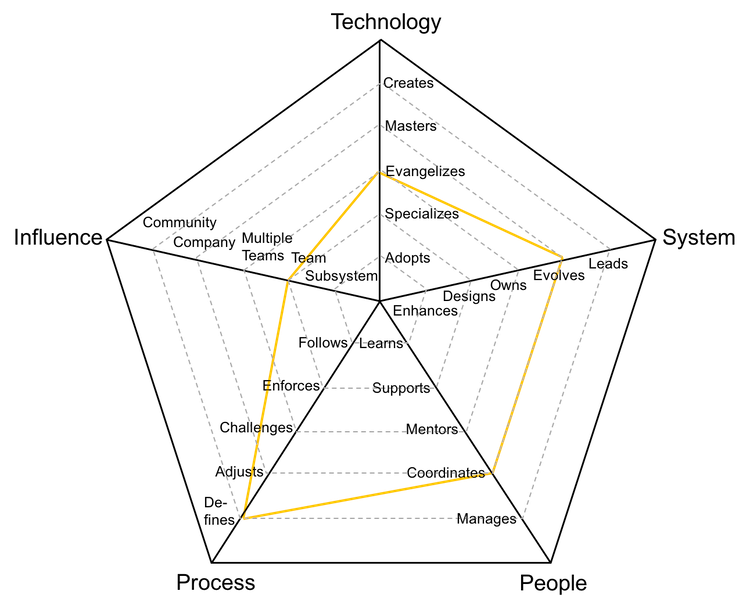

# Tech Specialist

Role also known as dev lead, is the owner of the system and requires a unique balance between hands-on development, architecture knowledge and production support.

| Level | Senior |                      Position                       |
| :---: | :----: | :-------------------------------------------------: |
|   4   |  Yes   | [TL4 - Tech Specialist 4](#tl4---tech-specialist-4) |
|   5   |  Yes   | [TL5 - Tech Specialist 5](#tl5---tech-specialist-5) |
|   6   |  Yes   | [TL6 - Tech Specialist 6](#tl6---tech-specialist-6) |
|   7   |  Yes   | [TL7 - Tech Specialist 7](#tl7---tech-specialist-7) |

## TL4 - Tech Specialist 4

<picture>
  <source media="(prefers-color-scheme: dark)" srcset="charts/tech-specialist-4-dark.png"/>
  <source media="(prefers-color-scheme: light)" srcset="charts/tech-specialist-4.png"/>
  
</picture>

- **Specializes**: is the go-to person for one or more technologies and takes initiative to learn new ones
- **Owns**: owns the production operation and monitoring of the system and is aware of its SLAs
- **Coordinates**: coordinates team members providing effective feedback and moderating discussions
- **Adjusts**: adjusts the team processes, listening to feedback and guiding the team through the changes
- **Subsystem**: makes an impact on one or more subsystems or team pods

## TL5 - Tech Specialist 5

<picture>
  <source media="(prefers-color-scheme: dark)" srcset="charts/tech-specialist-5-dark.png"/>
  <source media="(prefers-color-scheme: light)" srcset="charts/tech-specialist-5.png"/>
  
</picture>

- **Evangelizes**: researches, creates proofs of concept and introduces new technologies to the team
- **Evolves**: evolves the architecture to support future requirements and defines its SLAs
- **Coordinates**: coordinates team members providing effective feedback and moderating discussions
- **Defines**: defines the right processes for the team's maturity level, balancing agility and discipline
- **Team**: makes an impact on the whole team, not just on specific parts of it

## TL6 - Tech Specialist 6

<picture>
  <source media="(prefers-color-scheme: dark)" srcset="charts/tech-specialist-6-dark.png"/>
  <source media="(prefers-color-scheme: light)" srcset="charts/tech-specialist-6.png"/>
  
</picture>

- **Masters**: has very deep knowledge about the whole technology stack of the system
- **Leads**: leads the technical excellence of the system and creates plans to mitigate outages
- **Coordinates**: coordinates team members providing effective feedback and moderating discussions
- **Defines**: defines the right processes for the team's maturity level, balancing agility and discipline
- **Multiple Teams**: makes an impact not only on the whole team but also on other teams

## TL7 - Tech Specialist 7

<picture>
  <source media="(prefers-color-scheme: dark)" srcset="charts/tech-specialist-7-dark.png"/>
  <source media="(prefers-color-scheme: light)" srcset="charts/tech-specialist-7.png"/>
  
</picture>

- **Masters**: has very deep knowledge about the whole technology stack of the system
- **Leads**: leads the technical excellence of the system and creates plans to mitigate outages
- **Coordinates**: coordinates team members providing effective feedback and moderating discussions
- **Defines**: defines the right processes for the team's maturity level, balancing agility and discipline
- **Company**: makes an impact on the whole tech organization

# Other Pages

- [**Introduction**](README.md)
- [**Developer**](Developer.md)
- [**Technical Program Manager**](TechnicalProgramManager.md)
- [**Engineering Manager**](EngineeringManager.md)
- [**Tech Specialist vs Engineering Manager**](TechSpecialist-EngineeringManager.md)
- [**Managing Managers**](Managing-Managers.md)
