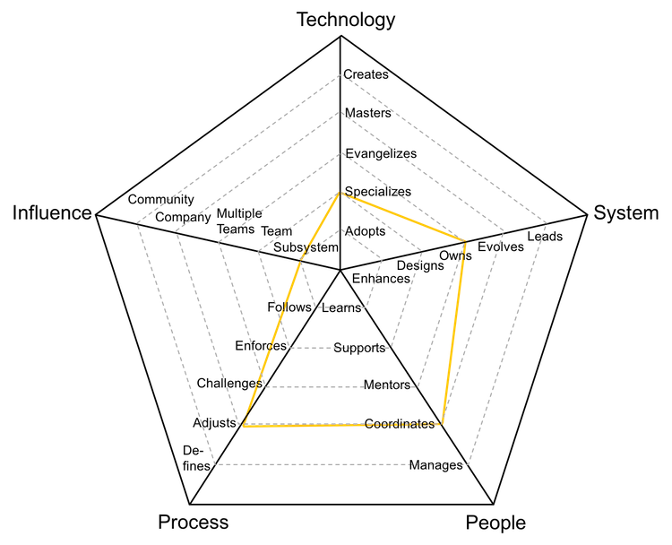
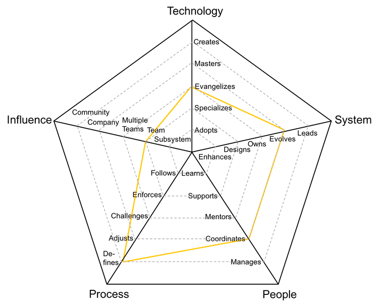
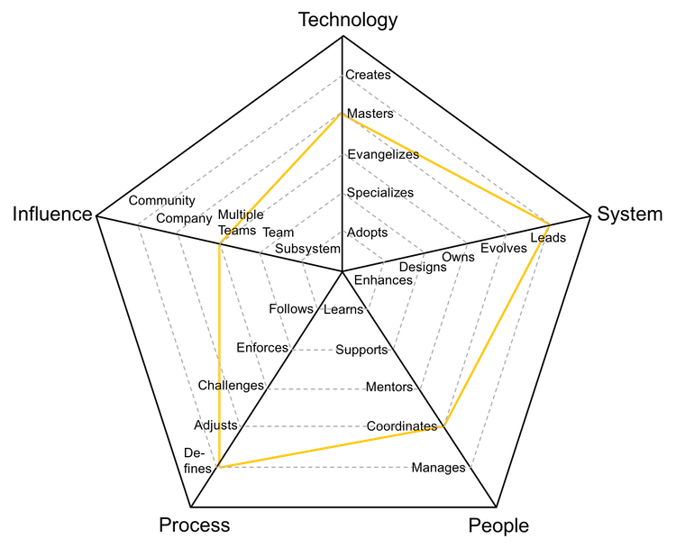
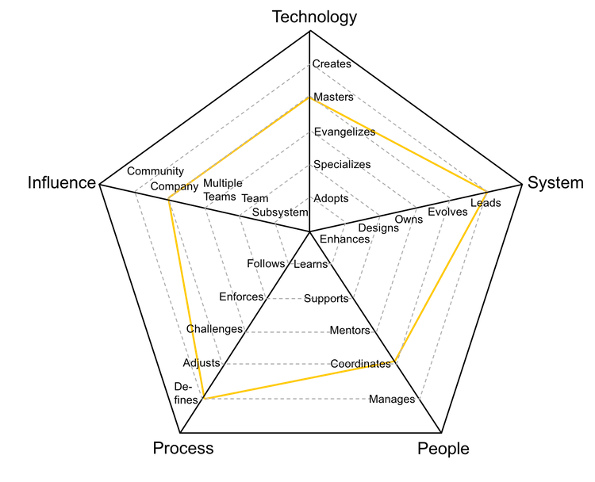

# テックリード

開発リードとも呼ばれるこの役割は、システムのオーナーであり、ハンズオン開発、アーキテクチャの知識、プロダクションサポートと言った、独自のバランスを求められます。

| レベル | Seniority | ポジション |
| :---: | :---: | :---: |
| 4 | Senior | [TL4 - テックリード 4](#tl4---テックリード-4) |
| 5 | Senior | [TL5 - テックリード 5](#tl5---テックリード-5) |
| 6 | Senior | [TL6 - テックリード 6](#tl6---テックリード-6) |
| 7 | Senior | [TL7 - テックリード 7](#tl7---テックリード-7) |

## TL4 - テックリード 4

* Specializes: 1つ以上の技術に精通しており、新しい技術を率先して学ぶ
* Owns: システムの運用と監視を担当し、SLAを把握している
* Coordinates: チームメンバーを調整し、効果的なフィードバックを提供し、ディスカッションをモデレートする
* Adjusts: チームのプロセスを調整し、フィードバックに耳を傾け、変更を通してチームを指導する
* Subsystem: 1つまたは複数のサブシステムに影響を与える

## TL5 - テックリード 5

* Evangelizes: 調査を行い、コンセプトを理解、証明し、新しい技術をチームに紹介する
* Evolves: 将来の要件をサポートするためにアーキテクチャを進化させ、そのSLAを定義する
* Coordinates: チームメンバーを調整し、効果的なフィードバックを提供し、ディスカッションを司会する
* Defines: チームの成熟度に合わせて適切なプロセスを定義し、アジリティと規律のバランスをとる
* Team: 特定の部分だけでなく、チーム全体に影響を与える

## TL6 - テックリード 6

* Masters: システムの技術スタック全体について非常に深い知識を持っている
* Leads: システムの技術的卓越性をリードし、障害を軽減するためのプランを作成する
* Coordinates: チームメンバーを調整し、効果的なフィードバックを提供し、ディスカッションをモデレートする
* Defines: チームの成熟度に合わせて適切なプロセスを定義し、アジリティと規律のバランスをとる
* Multiple Teams: 自分のチームだけでなく、他のチームにも影響を与える

## TL7 - テックリード 7

* **Masters**: has very deep knowledge about the whole technology stack of the system
* **Leads**: leads the technical excellence of the system and creates plans to mitigate outages
* **Coordinates**: coordinates team members providing effective feedback and moderating discussions
* **Defines**: defines the right processes for the team's maturity level, balancing agility and discipline
* **Company**: makes an impact on the whole tech organization

* Masters: システムの技術スタック全体について非常に深い知識を持っている
* Leads: システムの技術的卓越性をリードし、障害を軽減するためのプランを作成する
* Coordinates: チームメンバーを調整し、効果的なフィードバックを提供し、ディスカッションをモデレートする
* Defines: チームの成熟度に合わせて適切なプロセスを定義し、アジリティと規律のバランスをとる
* Company: 技術組織全体に影響を与える

# Other Pages

* [**イントロダクション**](README.md)
* [**開発者**](Developer.md)
* [**テクニカルプログラムマネージャー**](TechnicalProgramManager.md)
* [**エンジニアリングマネージャー**](EngineeringManager.md)
* [**テックリードとエンジニアリングマネージャーの違い**](TechLead-EngineeringManager.md)
* [**マネージャーをマネージすること**](Managing-Managers.md)