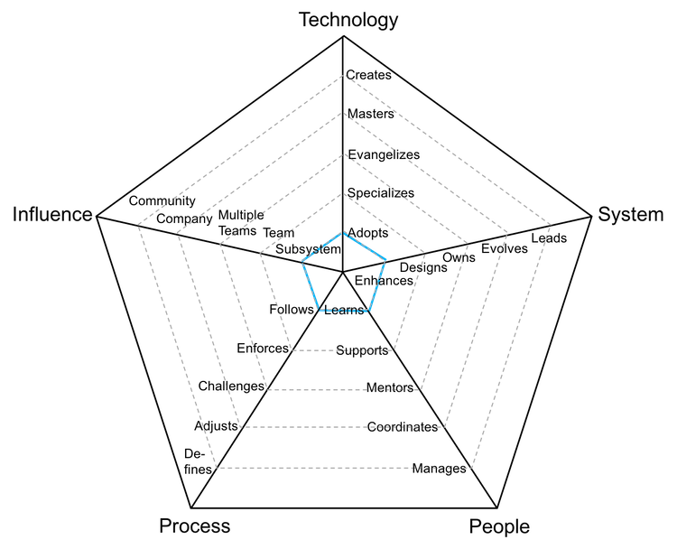
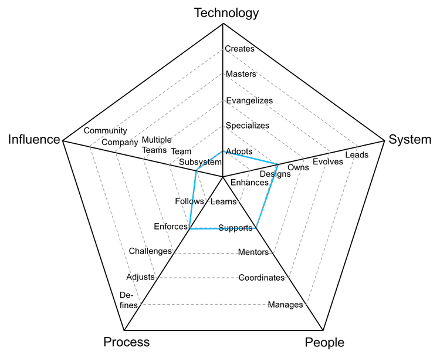
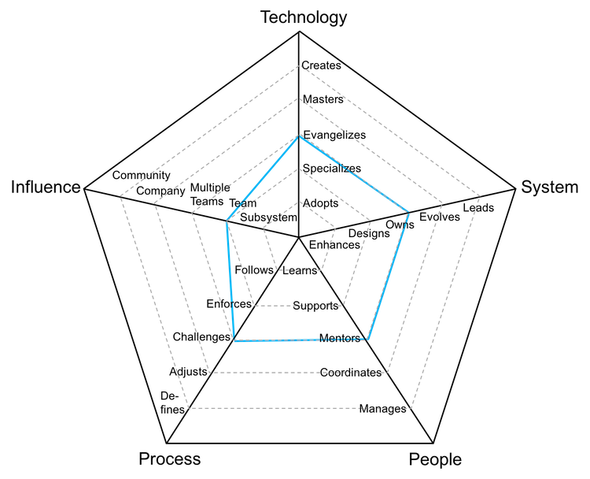
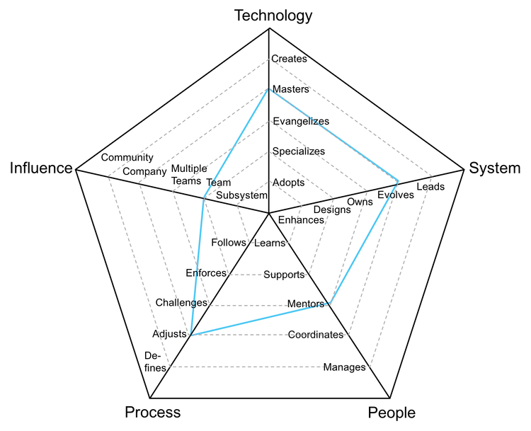
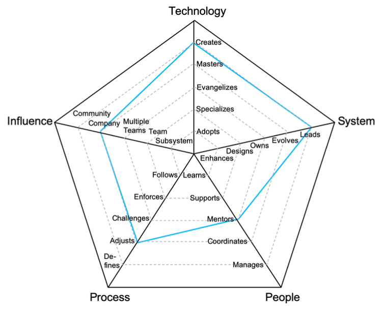
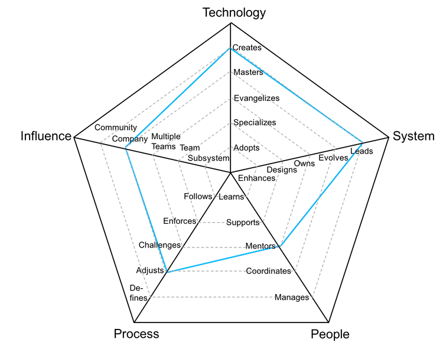

# 개발자

프로그래머 또는 엔지니어로 알려진 역할로, 깊은 수준의 기술적 경험을 필요로 함.

| 단계 | 숙련도 | 포지션 |
| :---: | :---: | :---: |
| 1 | 주니어 | [D1 - 개발자 1](#d1---developer-1) |
| 2 | 주니어 | [D2 - 개발자 2](#d2---developer-2) |
| 3 | 주니어 | [D3 - 개발자 3](#d3---developer-3) |
| 4 | 시니어 | [D4 - 개발자 4](#d4---developer-4) |
| 5 | 시니어 | [D5 - 개발자 5](#d5---developer-5) |
| 6 | 시니어 | [D6 - 개발자 6](#d6---developer-6) |
| 7 | 시니어 | [D7 - 개발자 7](#d7---developer-7) |

## D1 - 개발자 1

* **적응**: 적극적으로 학습하며 팀이 지정한 기술과 툴을 받아들인다
* **개선**: 시스템을 개선하기 위한 새로운 기능과 버그 수정을 성공적으로 제공한다
* **학습**: 빠르게 다른 이들에게서 배우며 필요할 경우 꾸준히 나선다
* **추종**: 팀 프로세스를 따르며, 프로덕션으로의 꾸준한 기능의 흐름을 제공한다
* **하위 시스템**: 하나 또는 그 이상의 하위 시스템에 영향을 준다

## D2 - 개발자 2

* **적응**: 적극적으로 학습하며 팀이 지정한 기술과 툴을 받아들인다
* **설계**: 시스템의 기술 부채를 줄여나가면서 중대형 기능을 설계 및 구현한다
* **지원**: 다른 팀 멤버들을 적극적으로 지원하며 그들이 성공할 수 있도록 돕는다
* **집행**: 팀 프로세스를 집행하며, 모든 이가 장점과 단점을 이해하도록 한다
* **하위 시스템**: 하나 또는 그 이상의 하위 시스템에 영향을 준다

## D3 - 개발자 3

* **특화**: 하나 또는 그 이상의 기술을 확실하게 책임지는 사람이며 새로운 것을 학습하는 주도권을 가진다
* **설계**: 시스템의 기술 부채를 줄여나가면서 중대형 기능을 설계 및 구현한다
* **지원**: 다른 팀 멤버들을 적극적으로 지원하며 그들이 성공할 수 있도록 돕는다
* **도전**: 팀 프로세스를 개선할 방법을 찾기 위해 도전한다
* **팀**: 특정 일부가 아닌 전체 팀에 영향을 미친다

## D4 - 개발자 4

* **전도**: 연구하고, POC(개념 증명)를 제작하며 팀에 새로운 기술을 소개한다
* **소유**: 프로덕션 운영 방식에 대한 소유권을 가지며 시스템을 모니터링하며 SLA(서비스 수준 동의)를 인지하고 있다
* **상담**: 다른이들에게 상담을 제공하여 커리어 성장을 가속하고 참여를 독려한다
* **도전**: 팀 프로세스를 개선할 방법을 찾기 위해 도전한다
* **팀**: 특정 일부가 아닌 전체 팀에 영향을 미친다

## D5 - 개발자 5

* **숙달**: 시스템의 모든 기술 스택에 관해 매우 깊은 지식을 가지고 있다
* **진화**: 미래 요구조건을 지원하기 위해 구조를 진화시키며 SLA를 규정한다
* **상담**: 다른이들에게 상담을 제공하여 커리어 성장을 가속하고 참여를 독려한다
* **변경**: 피드백을 듣고 팀의 변화를 지도하면서 팀 프로세스를 변경한다
* **다수의 팀**: 본인의 팀 뿐만 아니라 다른 팀에도 영향을 미친다

## D6 - 개발자 6

* **창조**: 내부 또는 외부 팀에게 널리 사용되는 새로운 기술을 설계하고 창조한다
* **인도**: 시스템의 기술적 완성도를 이끌며 서비스 중단 사태에 대한 계획을 수립한다
* **상담**: 다른이들에게 상담을 제공하여 커리어 성장을 가속하고 참여를 독려한다
* **변경**: 피드백을 듣고 팀의 변화를 지도하면서 팀 프로세스를 변경한다
* **회사**: 전체 기술 집단에게 영향을 미친다

## D7 - 개발자 7

* **창조**: 내부 또는 외부 팀에게 널리 사용되는 새로운 기술을 설계하고 창조한다
* **인도**: 시스템의 기술적 완성도를 이끌며 서비스 중단 사태에 대한 계획을 수립한다
* **상담**: 다른이들에게 상담을 제공하여 커리어 성장을 가속하고 참여를 독려한다
* **변경**: 피드백을 듣고 팀의 변화를 지도하면서 팀 프로세스를 변경한다
* **커뮤니티**: 기술 커뮤니티에 영향을 미친다

# 다른 페이지

* [**소개**](README.md)
* [**기술 리드**](TechLead.md)
* [**기술 프로그램 매니저**](TechnicalProgramManager.md)
* [**엔지니어링 매니저**](EngineeringManager.md)
* [**기술 리드 vs 엔지니어링 매니저**](TechLead-EngineeringManager.md)
* [**매니저 관리하기**](Managing-Managers.md)
