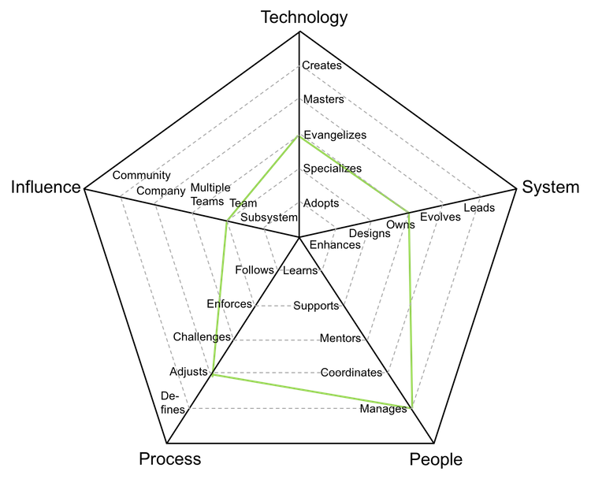
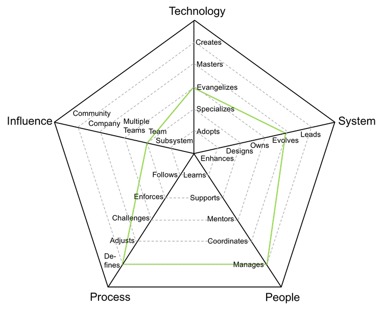
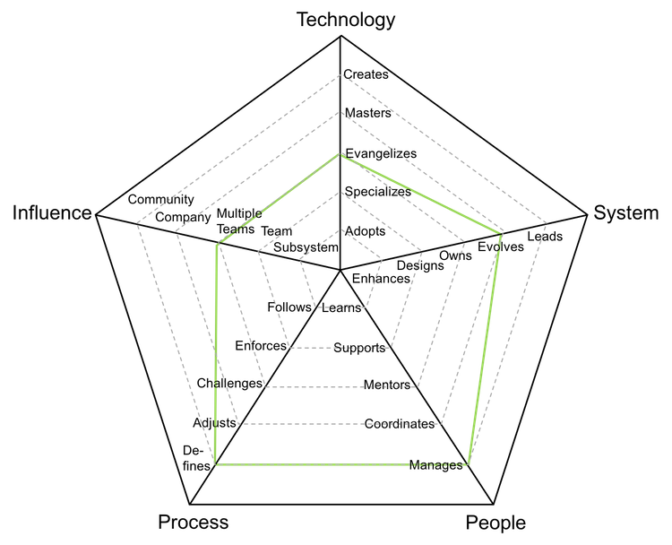

# 엔지니어링 매니저

개발 관리자로도 불리는 역할로, 꾸준한 배포, 커리어 성장 및 팀의 행복도의 책임을 짐.

| 단계 | 숙련도 |                         포지션                          |
| :---: | :-------: | :-------------------------------------------------------: |
|   5   |  시니어   | [EM5 - 엔지니어링 매니저 5](#em5---engineering-manager-5) |
|   6   |  시니어   | [EM6 - 엔지니어링 매니저 6](#em6---engineering-manager-6) |
|   7   |  시니어   | [EM7 - 엔지니어링 매니저 7](#em7---engineering-manager-7) |

If you have other managers as direct reports, you might want to read the [Managing Managers](Managing-Managers.md) section since it provides more information about the "Manages People" aspect of the role.

## EM5 - 엔지니어링 매니저 5

- **전도**: 연구하고, POC(개념 증명)를 제작하며 팀에 새로운 기술을 소개한다
- **소유**: 프로덕션 운영 방식에 대한 소유권을 가지며 시스템을 모니터링하며 SLA(서비스 수준 동의)를 인지하고 있다
- **관리**: 팀 멤버들의 커리어, 기대치, 생산성과 행복도를 관리한다
- **변경**: 피드백을 듣고 팀의 변화를 지도하면서 팀 프로세스를 변경한다
- **팀**: 특정 일부가 아닌 전체 팀에 영향을 미친다

## EM6 - 엔지니어링 매니저 6

- **전도**: 연구하고, POC(개념 증명)를 제작하며 팀에 새로운 기술을 소개한다
- **진화**: 미래 요구조건을 지원하기 위해 구조를 진화시키며 SLA를 규정한다
- **관리**: 팀 멤버들의 커리어, 기대치, 생산성과 행복도를 관리한다
- **정의**: 신속성과 절제의 균형을 맞추면서 팀의 숙련도에 따라 가장 적절한 프로세스를 정의한다
- **팀**: 특정 일부가 아닌 전체 팀에 영향을 미친다

## EM7 - 엔지니어링 매니저 7

- **전도**: 연구하고, POC(개념 증명)를 제작하며 팀에 새로운 기술을 소개한다
- **진화**: 미래 요구조건을 지원하기 위해 구조를 진화시키며 SLA를 규정한다
- **관리**: 팀 멤버들의 커리어, 기대치, 생산성과 행복도를 관리한다
- **정의**: 신속성과 절제의 균형을 맞추면서 팀의 숙련도에 따라 가장 적절한 프로세스를 정의한다
- **다수의 팀**: 본인의 팀 뿐만 아니라 다른 팀에도 영향을 미친다

# 다른 페이지

- [**소개**](README.md)
- [**개발자**](Developer.md)
- [**기술 리드**](TechLead.md)
- [**기술 프로그램 매니저**](TechnicalProgramManager.md)
- [**기술 리드 vs 엔지니어링 매니저**](TechLead-EngineeringManager.md)
- [**매니저 관리하기**](Managing-Managers.md)
