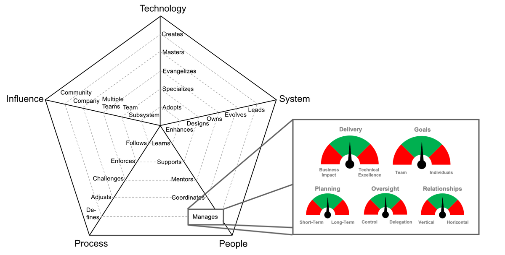
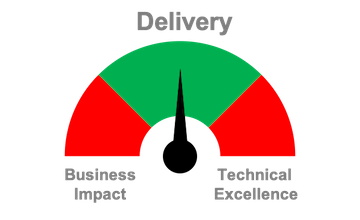
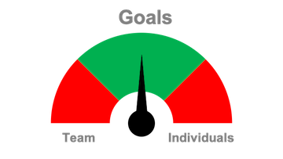
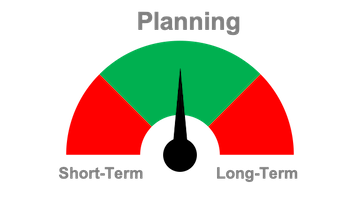
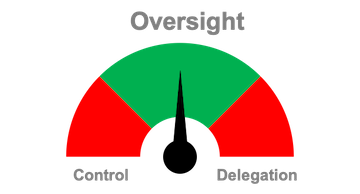
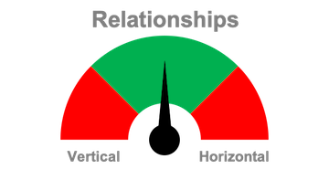

# 매니저 관리하기

## 도입

매니저 사다리를 올라가다 보면, 직속 담당자에 다른 매니저가 포함되게 마련입니다.
매니저의 행동은 그들의 팀에 더 큰 영향을 가지므로 기대치를 다르게 설정해야 합니다.

어떻게 다른 매니저의 매니징 기술을 평가할까요?
매니저는 언제나 상충하는 압력들을 마주해야 하며, 균형을 유지하는 것이 그들의 업무 중 큰 부분을 차지합니다.
적절한 기대치를 설정하고 매니저의 성공을 측정하기 위해서는 다음 분야들에서 얼마나 균형을 유지하고 있는지 알아보는 것이 중요합니다:

## 인도

매니저는 사업에서의 빠른 가치 인도 요구와 팀 내에서의 수준 높은 해결법 인도를 원하는 압력을 마주해야 합니다.

| 사업 영향도 | 기술적 완성도 |
| :--- | :--- |
| 속도 | 퀄리티 |
| 소비자 피드백 | 코드 유지보수 용이성 |
| 기회 비용 | 기술 부채 비용 |

## 목표

팀과 개인의 목표를 정렬하는 것은 팀이 집단에 가치를 인도하면서 그 구성원들이 커리어의 발전을 만들어내는 시나리오를 만들어내는 데 있어 매우 중요합니다. 매니저는 양 측 (팀과 개인)에게 모두 도움이 되는 Win-Win 시나리오를 만들기 위해 노력해야 합니다.

| 팀 | 개인 |
| :--- | :--- |
| 사업적 필요 | 커리어 집중 |
| 팀 기대치 | 개인 관심사 |
| 그룹 성과 | 개인 성과 |

## 계획

비록 단기 대 장기 계획이 종종 "사업 대 기술"과 같은 토론으로 비춰지곤 하지만([인도](#인도)를 보세요), 항상 그렇지는 않습니다. 많은 경우 관리자는 신속한 사업 (또는 기술적) 해법과 장기적인 것 사이에서 균형을 찾아야 합니다. 이 버그를 신속하게 고칠까요, 아니면 제대로 된 기술적 해법을 위해 투자할까요? 신속하게 버려질 Spike 를 만들어낼까요, 아니면 잘 설계된 기능에 투자할까요?

| 단기 | 장기 |
| :--- | :--- |
| 주간 계획 | 분기 계획 |
| 신속 대응(Spike) | 잘 설계된 기획 |
| 신속한 처리 | 제대로 된 처리 |

## 감독

매니저는 팀에 대한 통제를 잃지 않으면서도 효과적으로 위임하는 적정 수준을 찾는데 어려움을 겪습니다. 방해 요소 없이 세부 사항들을 꿰뚫고 있기는 매니저에게 가장 어려운 일이라고 할 수 있습니다(특히 매니저의 매니저인 경우에는). 매니저들은 벌어지는 일들을 휘하에 두면서도 팀에게 결정할 수 있도록 힘을 실어줘야 합니다.

| 통제 | 위임 |
| :--- | :--- |
| 미세 통제 | 권한 부여 |
| 세부사항 파악 | 큰 그림 파악 |
| 검열 | 신뢰 |

## 관계

대부분의 매니저들이 그들의 직속 부하(하방)와 상사(상방)와의 관계 유지는 잘 하겠지만, 집단 외 다른 사람들과의 관계의 가치를 덜 중요하게 생각하는 경향이 있습니다. 수평적 관계에 대해 집중하지 못하는 경우 여러 팀간의 발언권에는 리스크를 증가시키고 팀의 영향력을 알아볼 수 있는 매니저의 시야를 좁게 만듭니다.

| 수직 (위/아래 관리) | 수평 (넓은 시야) |
| :--- | :--- |
| 관리자들 | 이해당사자 |
| 직속 부하 | 동료 / 다른 팀 |
| 간접 보고자 | 이용자 |

## 결론

매니저를 평가하는 데에는 다소 다른 관점이 필요하며, 그들의 행동은 각자의 팀에 더 큰 영향을 미치므로 모든 것의 균형을 유지할 책임을 가집니다.

매니저는 각 분야간의 균형을 맞춰야 하며 -인도, 목표, 계획, 감독 및 관계- 이는 장기간 유지될 수 있는 방식이어야 합니다. 모든 영역이 똑같은 방식으로 균형이 맞춰질 필요는 없습니다; 팀의 숙련도, 회사의 문화, 사업적 문맥이 화살표를 한쪽으로 몰 수도 있고, 녹색 영역은 말 그대로 범위이지 하나의 값이 아닙니다. 그렇지만, 어느 한 쪽 극단에 너무 가까이 접근하지 않도록 노력하는 것이 중요합니다.

요약하면, 각 매니저가 각 영역에서 내는 성과를 이해하는 것이 그들의 전체 성과를 평가하는 좋은 방법이며 따라서 그들과 유의미한 커리어 대화를 나누는 데 좋은 기회가 될 것입니다.

# 다른 페이지

* [**소개**](README.md)
* [**개발자**](Developer.md)
* [**기술 리드**](TechLead.md)
* [**기술 프로그램 매니저**](TechnicalProgramManager.md)
* [**엔지니어링 매니저**](EngineeringManager.md)
* [**기술 리드 vs 엔지니어링 매니저**](TechLead-EngineeringManager.md)
