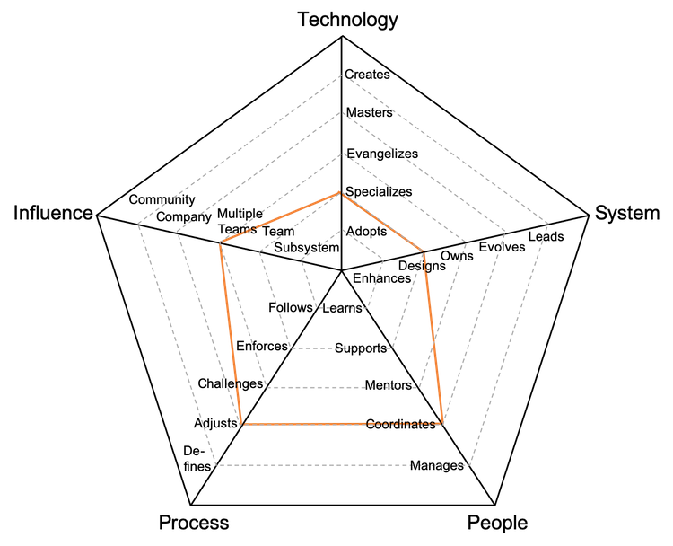
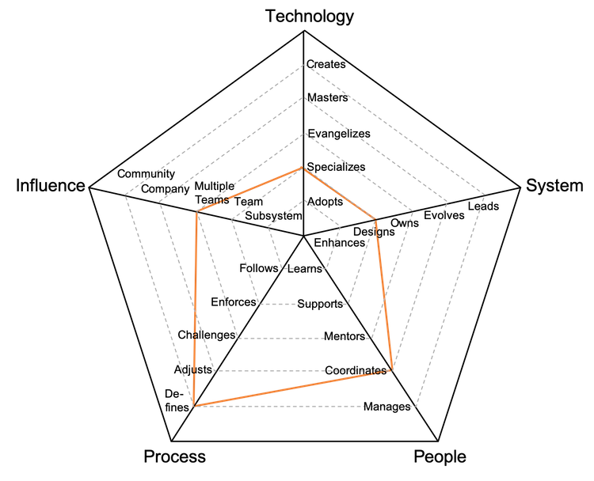
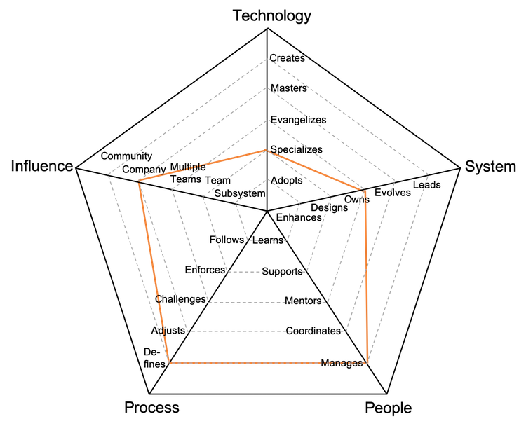
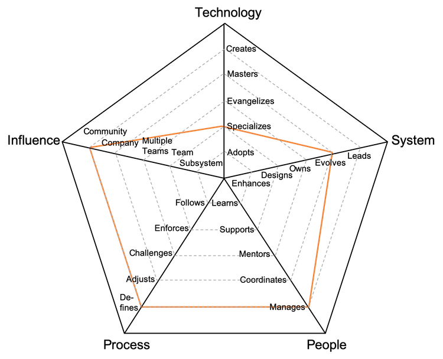

# 기술 프로그램 매니저

여러 팀에 걸쳐 업무 조율 및 완성 주도권을 향한 독려의 책임을 짐.

| 단계 | 숙련도 | 포지션 |
| :---: | :---: | :---: |
| 4 | 시니어 | [TPM4 - 기술 프로그램 매니저 4](#tpm4---technical-program-manager-4) |
| 5 | 시니어 | [TPM5 - 기술 프로그램 매니저 5](#tpm5---technical-program-manager-5) |
| 6 | 시니어 | [TPM6 - 기술 프로그램 매니저 6](#tpm6---technical-program-manager-6) |
| 7 | 시니어 | [TPM7 - 기술 프로그램 매니저 7](#tpm7---technical-program-manager-7) |

## TPM4 - 기술 프로그램 매니저 4

* **특화**: 하나 또는 그 이상의 기술을 확실하게 책임지는 사람이며 새로운 것을 학습하는 주도권을 가진다
* **설계**: 시스템의 기술 부채를 줄여나가면서 중대형 기능을 설계 및 구현한다
* **조정**: 팀 멤버들간의 조정에 나서며 효과적인 피드백을 제공하며 의견을 조율한다
* **변경**: 피드백을 듣고 팀의 변화를 지도하면서 팀 프로세스를 변경한다
* **다수의 팀**: 본인의 팀 뿐만 아니라 다른 팀에도 영향을 미친다

## TPM5 - 기술 프로그램 매니저 5

* **특화**: 하나 또는 그 이상의 기술을 확실하게 책임지는 사람이며 새로운 것을 학습하는 주도권을 가진다
* **설계**: 시스템의 기술 부채를 줄여나가면서 중대형 기능을 설계 및 구현한다
* **조정**: 팀 멤버들간의 조정에 나서며 효과적인 피드백을 제공하며 의견을 조율한다
* **정의**: 신속성과 절제의 균형을 맞추면서 팀의 숙련도에 따라 가장 적절한 프로세스를 정의한다
* **다수의 팀**: 본인의 팀 뿐만 아니라 다른 팀에도 영향을 미친다

## TPM6 - 기술 프로그램 매니저 6

* **특화**: 하나 또는 그 이상의 기술을 확실하게 책임지는 사람이며 새로운 것을 학습하는 주도권을 가진다
* **소유**: 프로덕션 운영 방식에 대한 소유권을 가지며 시스템을 모니터링하며 SLA(서비스 수준 동의)를 인지하고 있다
* **관리**: 팀 멤버들의 커리어, 기대치, 생산성과 행복도를 관리한다
* **정의**: 신속성과 절제의 균형을 맞추면서 팀의 숙련도에 따라 가장 적절한 프로세스를 정의한다
* **회사**: 전체 기술 집단에게 영향을 미친다

## TPM7 - 기술 프로그램 매니저 7

* **특화**: 하나 또는 그 이상의 기술을 확실하게 책임지는 사람이며 새로운 것을 학습하는 주도권을 가진다
* **진화**: 미래 요구조건을 지원하기 위해 구조를 진화시키며 SLA를 규정한다
* **관리**: 팀 멤버들의 커리어, 기대치, 생산성과 행복도를 관리한다
* **정의**: 신속성과 절제의 균형을 맞추면서 팀의 숙련도에 따라 가장 적절한 프로세스를 정의한다
* **커뮤니티**: 기술 커뮤니티에 영향을 미친다

# 다른 페이지

* [**소개**](README.md)
* [**개발자**](Developer.md)
* [**기술 리드**](TechLead.md)
* [**엔지니어링 매니저**](EngineeringManager.md)
* [**기술 리드 vs 엔지니어링 매니저**](TechLead-EngineeringManager.md)
* [**매니저 관리하기**](Managing-Managers.md)
